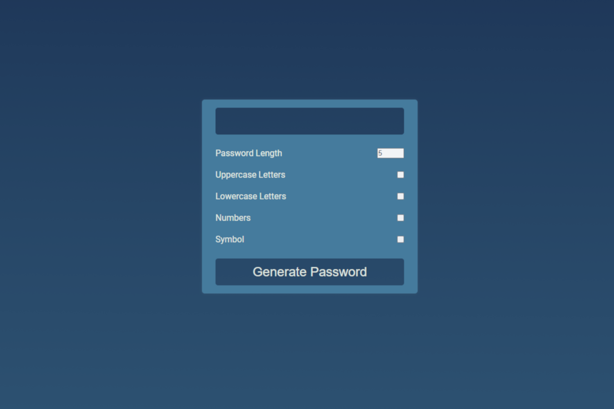

# Sign & Signup PHP

### A Vanilla JavaScript password generator, with a modern design with several features.



## INSTALLATION

```sh
git clone https://github.com/An0n341/Password-Generator-JS-Vanilla.git

cd Password-Generator-JS-Vanilla
```

## HOW TO USE

This password generator has several features: choose the length of the password (maximum of 20 characters), copy it, choose the composition, add lowercase, uppercase, numbers and special symbols.

## LICENSE

This program is distributed under the license [GNU General Public License v3](LICENSE), please read the license for information on program distribution and availability.
